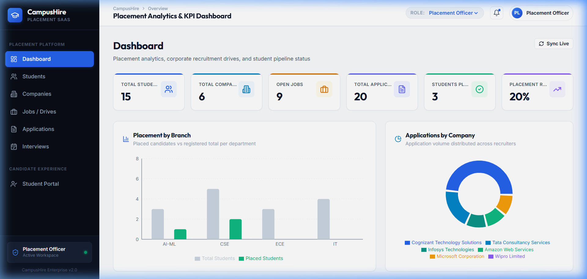
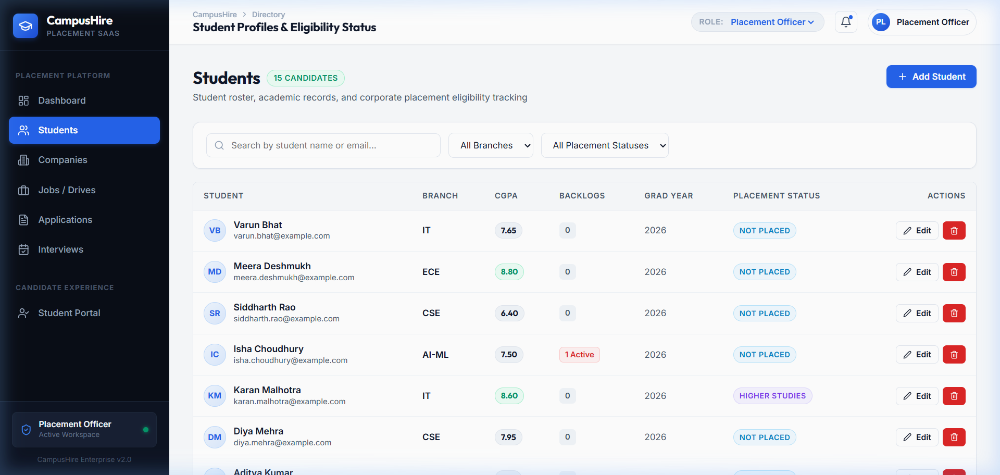
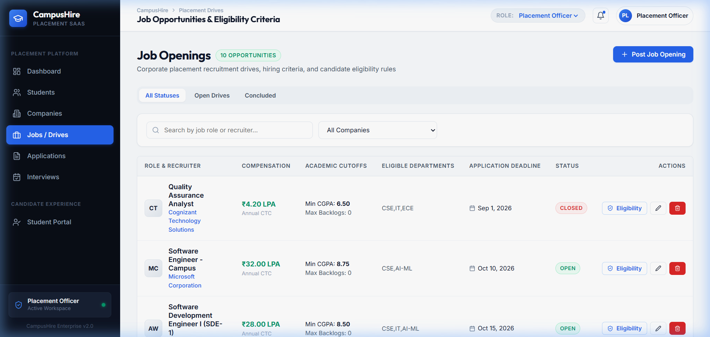
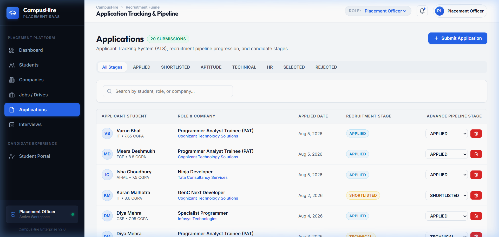
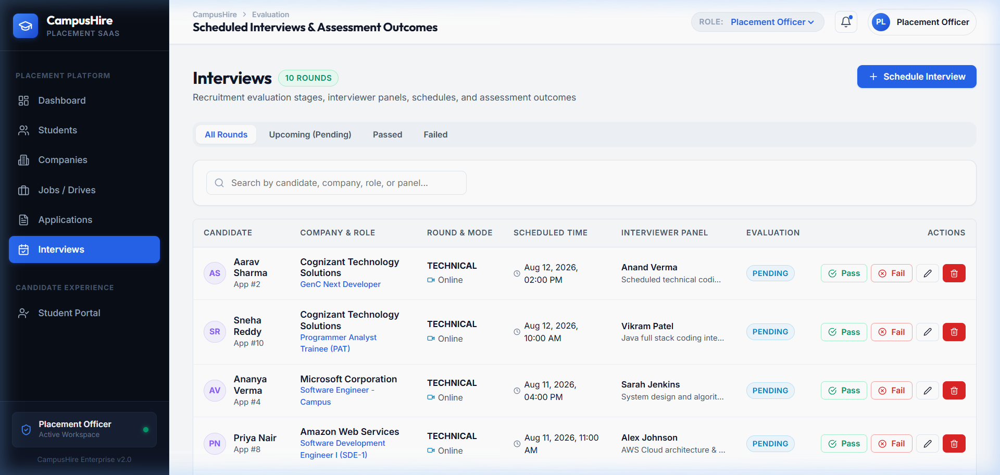
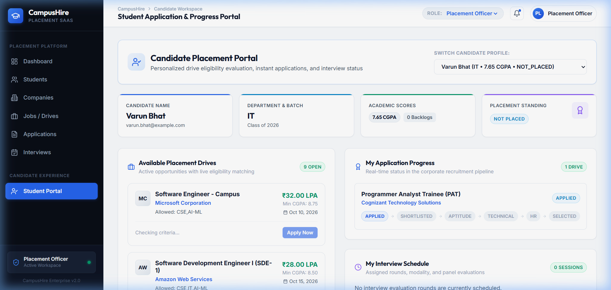

# CampusHire

A full-stack campus placement management portal for managing students, companies, job drives, applications, eligibility, and interviews.


---

## 📸 Screenshots

### Dashboard
Overview of placement numbers, branch statistics, company applications, and salary packages.



---

### Students
List of registered students with their CGPA, department, backlogs, and current placement status.



---

### Jobs
Placement drives posted by companies with salary packages, cutoff criteria, and deadlines.



---

### Applications
Applicant tracking system showing student progress across interview stages.



---

### Interviews
Interview schedule with rounds, mode (Online/Offline), panel interviewers, and pass/fail results.



---

### Student Portal
A dedicated portal where students can check which jobs they can apply for and track their applications.



---

## What is CampusHire?

CampusHire is a web application made for colleges and universities.

It helps the placement cell run recruitment drives smoothly by keeping everything in one place:
- College coordinators can manage students, recruiting companies, job openings, and interview rounds.
- Students have their own portal where they can see matching jobs, check if they meet the requirements, and apply with one click.
- The system automatically checks if a student is eligible before letting them apply.

---

## Key Features

| Feature | What it does |
|---|---|
| **Student Management** | Add, edit, search, and view student academic details and placement status |
| **Company Management** | Keep track of recruiting companies, locations, contacts, and websites |
| **Job Drives** | Create job openings with salary packages, allowed branches, and cutoffs |
| **Eligibility Checker** | Checks CGPA, backlogs, branch, and deadline before allowing applications |
| **Applications (ATS)** | Track each candidate through stages from Applied to Selected |
| **Interviews** | Schedule interview rounds and record pass or fail results |
| **Student Portal** | Students can view matching jobs, see eligibility reasons, and track progress |
| **Placement Tracking** | Updates a student to "Placed" automatically when they are selected |

---

## Tech Stack

### Frontend (Website)
- **React 18** — A modern JavaScript library used to build fast user interfaces.
- **Vite** — A tool that builds and runs the React frontend quickly.
- **Axios** — Used by React to send HTTP requests to the backend.
- **Recharts** — Creates the charts on the dashboard.

### Backend (Server)
- **Java 21** — The core programming language for the backend.
- **Spring Boot 3** — The main framework that runs the server and handles business logic.
- **REST APIs** — How the frontend communicates with the backend using JSON.
- **Spring Data JPA & Hibernate** — Helps Java code read and save data in MySQL without writing manual SQL queries.

### Database (Storage)
- **MySQL 8** — The database that securely stores all student, company, and job data.
- **Flyway** — Manages database migrations automatically on startup so tables are always ready.

### DevOps & Deployment
- **Docker & Docker Compose** — Packages the frontend, backend, and database into containers so the app can run anywhere.
- **Nginx** — Serves the frontend and forwards API calls to the backend.

---

## How It Works

Here is how data flows through CampusHire:

```text
React Frontend (Browser)
       │
       ▼  Sends HTTP / REST API requests
Spring Boot Controllers
       │
       ▼  Validates inputs & runs business rules
Service Layer (Eligibility & Placement Rules)
       │
       ▼  JPA / Hibernate manages database queries
MySQL 8 Database (Managed by Flyway)
```

1. **User clicks an action**: For example, a student clicks **Apply Now** on a job.
2. **Frontend calls the API**: React sends a request to `/api/applications/apply`.
3. **Backend checks the rules**: The Spring Boot service checks if the student's CGPA is high enough, if they have too many backlogs, if their branch is allowed, and if the deadline has passed.
4. **Data is saved**: If eligible, Hibernate saves the new application into MySQL.
5. **Screen updates**: React receives the confirmation and updates the screen instantly.

---

## Project Structure

```text
Campus_Hire/
├── backend/                  # Spring Boot 3 Java backend
│   ├── src/main/java/        # Controllers, Services, Entities, and Repositories
│   └── src/main/resources/   # Application settings and Flyway SQL migration files
├── frontend/                 # React 18 frontend built with Vite
│   ├── src/components/       # Reusable UI elements (cards, badges, modals, tables)
│   └── src/pages/            # Dashboard, Students, Companies, Jobs, Portal pages
├── docs/                     # Project documentation
│   └── screenshots/          # Real application screenshots used in this README
├── docker-compose.yml        # Multi-container setup for MySQL, Backend, and Frontend
├── .env.example              # Example environment settings
├── README.md                 # Project documentation
└── .gitignore                # Prevents temporary and build files from being committed
```

- `backend/` contains all Java code, business services, and database migration scripts.
- `frontend/` contains the React user interface, pages, styles, and API clients.
- `docs/screenshots/` contains real screenshots of the running application.

---

## Run Locally

### Option 1 — Using Docker (Recommended)

Docker runs the entire stack (MySQL, Backend, and Frontend) in one step:

1. **Clone the repository**:
   ```bash
   git clone https://github.com/Aakash-Lalwani/Campus_Hire.git
   cd Campus_Hire
   ```

2. **Create your environment file**:
   ```bash
   cp .env.example .env
   ```

3. **Start the application**:
   ```bash
   docker compose up --build
   ```

4. **Open in your browser**:
   - **Frontend**: [http://localhost:5173](http://localhost:5173) (or `http://localhost`)
   - **Backend API**: [http://localhost:8080/api](http://localhost:8080/api)

---

### Option 2 — Without Docker

#### Step 1: Start MySQL
Make sure MySQL 8 is running locally and create a database named `campushire`:
```sql
CREATE DATABASE campushire;
```

#### Step 2: Run Backend
```bash
cd backend
mvn clean test
mvn spring-boot:run
```
*Flyway will automatically create all tables and insert sample demo data on first start.*

#### Step 3: Run Frontend
In a new terminal window:
```bash
cd frontend
npm install
npm run dev
```

Open [http://localhost:5173](http://localhost:5173) in your browser.

---

## Author

**Aakash Lalwani** — [GitHub Profile](https://github.com/Aakash-Lalwani)
